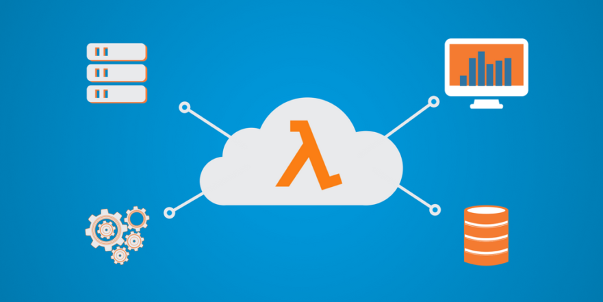

# Serverless Architecture

- Also known as serverless computing or Function as a Service (FaaS)
- Server infra is hosted by a third-party service (similar to PaaS)
- App is broken down into individual autonomous functions that can be invoked and scaled individually
- Event-driven cloud computing execution model
- Cloud provider dynamically manages the allocation and provisioning of servers
- Serverless applications run in stateless compute containers that are event-triggered and ephemeral (may last only
  one invocation)
- Pricing is based on the number of executions rather than pre-purchased compute capacity.

Services offered: IBM OpenWhisk, AWS Lambda, Azure Functions, Google Cloud Functions, Kubeless

### Serverless Computing

- Concept of building and running applications that do no require server management
- No longer need servers to host and run code - server provisioning, maintainence, updates, scaling, and capacity
 planning
- Servers are still required to run a serverless platform. However, rather than the developer, the provider (e.g. AWS
) will need to manage servers (or) virtual machines (or) containers. Provider incurs cost of running the platform
 even when idle

Serverless computing platforms may provide one or both of the following:
1) Functions-as-a-Service (FaaS) => event-driven computing. Developers run and manage application code with functions
 that are triggered by events or HTTP requests by deploying small units of code to the FaaS service which are then
  executed as discrete actions when needed. The provider enables scaling these functions without the need to manage
   servers or other underlying infrastructure.

2) Backend-as-a-Service (BaaS) => 3rd part API based services that replace core subsets of functionality which auto
-scales and operates transparently

### Benefits

1. Zero Server Ops: No need to bear the overhead of server resources/infrastructure (operators, machines etc.)
2. Flexible Scaling: Increases/Decreases in traffic is handled through auto-scaling instantaneously
3. No compute cost for resources not used (meaning, when code is not running or no meaningful work is done). There
 could be additional costs associated with storage or other capabilities.

### Best for use cases involving:

- Asynchronous, concurrent, easy-to-parallelize independent units of work
- Infrequent or sporadic demand (or) large unpredictable variance in scaling requirements
- Stateless (state that doesn't need to persevered across executions), Ephemeral (short computation/execution and
 done), without a major need for instantaneous cold start time (it is still possible to keep them warm if required)
- Highly dynamic business requirements that drive a need for accelerated developer velocity (the norm with building
 new products that need market validation)
 
### Container-as-a-Service (CaaS)

- You maintain full control over infrastructure (and runtime environment) and get maximum portability and reusability
 (e.g.) Kubernetes, Docker Swarm, Apache Mesos
- Container orchestration platforms allow teams to build and deploy portable applications with flexibility and
 control over configuration which can run anywhere without the need to reconfigure and deploy for different
  environments
- It makes it easy to bring existing containerized apps into the cloud, because of the degree of freedom provided by
 a less-opinionated application deployment model

### Platform-as-a-Service (PaaS)

- Enable teams to deploy and scale applications using a broad set of runtimes, binding to a catalog of services
 through injection of configuration information into the application
- Examples: Cloud Foundry, OpenShift, Deis, Heroku
- No need to manually configure and manage a container and OS
- Great fit for existing apps that have a stable programming model
- Pros: Easier management and deployment of applications, auto-scaling and pre-configured services for most common needs
- Cons: Lack of OS control, granular container portability, load balancing and application optimization, potential
 vendor lock-in, need ot build & manage your own monitoring and logging capabilities
 
### Serverless Processing Model

A FaaS solution has the following key elements:

- FaaS Controller: deploy, control, and monitor function instances and their sources
- Event Sources - that trigger a synchronous or asynchronous invocation
- Function Instance: a single function or microservice that can be scaled with demand
- Platform Services (identity, data): general cluster or cloud services used by the FaaS solution (BaaS)

### Lifecycle of a Function

The creation of a function involves the following steps:

- Writing code and providing specifications and metadata
- The "builder" entity will take the code and specs, compile and turn it into an artifact (a code binary, package or
 container image)
- Artifacts get deployed on a cluster with a controller entity (this entity is in charge of scaling the number of
 function instances based on events traffic)
 
The deployment a function usually needs to support the following use cases:
- Event steaming: there may be events in queue
- Warm startup: a function that has minimal number of instances at any time, so that the function is already deployed
 and ready to serve the first event
 
