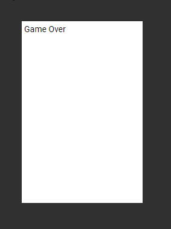

# Alphabet Invasion

Based on the example by `adamlubek` here: https://www.learnrxjs.io/learn-rxjs/recipes/alphabet-invasion-game


### Full Code

```html
<div class="full-size">
  <div class="game-container">
    <div
      class="game-area"
      [ngStyle]="{'width': gameWidth + 'px', 'height': gameHeight + 'px'}"
    >
      <ng-container *ngIf="isGameOver === false else elseBlock">
        <span>Score: {{score}}</span>
        <div *ngFor="let alphabet of alphabetArray" class="game-row">
          <span
            [ngStyle]="{'left': alphabet.yPos + 'px'}"
            class="alphabet-container"
            >{{ alphabet.value }}</span
          >
        </div>
      </ng-container>
      <ng-template #elseBlock>
        <div class="game-over">
          Game Over
        </div>
      </ng-template>
    </div>
  </div>
</div>
```

```css
.example-container {
  flex: 1;
  height: 100vh;
  border: 1px solid #555;
}

.sidenav {
  width: 200px;
  display: flex;
  flex-direction: column;
  padding-top: 16px;
}

.sidenav-option {
  color: #fff;
  text-decoration: none;
  padding: 16px;
  font-size: 1rem;
  text-transform: uppercase;
  border-left: 2px solid white;
  display: flex;
  justify-content: center;
}
```

```js
import { Component, OnInit } from "@angular/core";
import { combineLatest, fromEvent, interval, Observable } from "rxjs";
import { map, scan, startWith, takeWhile } from "rxjs/operators";

export interface Alphabet {
  value: String;
  yPos: number;
}
export interface State {
  score: number;
  alphabets: Alphabet[];
}

@Component({
  selector: "app-alphabet-invasion",
  templateUrl: "./alphabet-invasion.component.html",
  styleUrls: ["./alphabet-invasion.component.css"]
})
export class AlphabetInvasionComponent implements OnInit {
  constructor() {}

  public endThreshold = 15;
  public gameWidth = 200;
  public gameHeight = 300;
  public isGameOver = false;
  public gameSpeed = 600;
  public score = 0;

  private getRandomLetter = (): string =>
    String.fromCharCode(
      Math.random() * ("z".charCodeAt(0) - "a".charCodeAt(0)) +
        "a".charCodeAt(0)
    );

  public alphabetArray: Alphabet[] = [];

  private getRandomPosition = (): number =>
    Math.floor(Math.random() * (this.gameWidth - 20));

  private getKey$ = (): Observable<string> =>
    fromEvent(document, "keydown").pipe(
      startWith({ key: "" }),
      map((e: KeyboardEvent) => e.key)
    );

  private getAlphabets$ = (): Observable<Alphabet[]> =>
    interval(this.gameSpeed).pipe(
      scan(alphabets => {
        const newAlphabet = {
          value: this.getRandomLetter(),
          yPos: this.getRandomPosition()
        };
        return [newAlphabet, ...alphabets];
      }, [])
    );

  private nextFn = (state: State): void => {
    this.alphabetArray = state.alphabets;
    this.score = state.score;
  };

  private errorFn = (): void => {};

  private completeFn = (): void => {
    this.isGameOver = true;
  };

  private getGame$ = (): Observable<State> =>
    combineLatest([this.getKey$(), this.getAlphabets$()]).pipe(
      scan(
        (state: State, [key, alphabets]: [string, Alphabet[]]) => {
          if (alphabets[alphabets.length - 1].value === key) {
            state.score += 1;
            alphabets.pop();
          }
          return {
            alphabets,
            score: state.score
          };
        },
        { score: 0, alphabets: [] }
      ),
      takeWhile(state => state.alphabets.length < this.endThreshold)
    );

  ngOnInit(): void {
    this.getGame$().subscribe(this.nextFn, this.errorFn, this.completeFn);
  }
}
```
